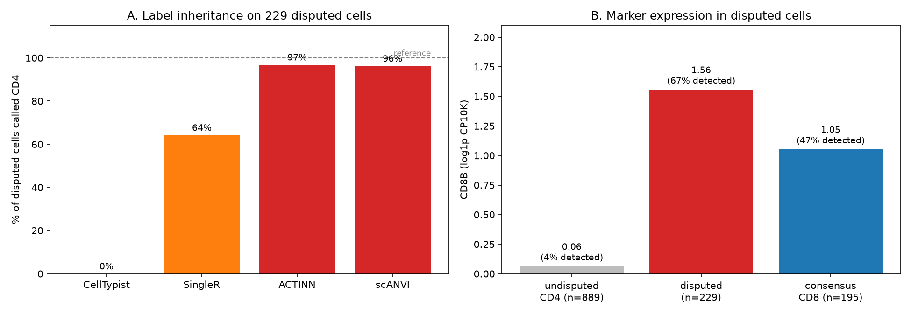
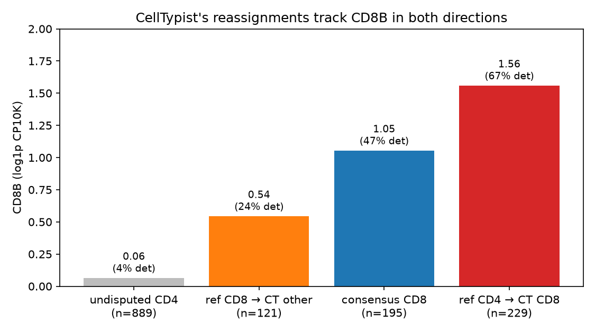

# Cell Type Annotation in scRNA-seq: A Practical Comparison of Modern Methods

Learning project. Exploratory benchmark. The case study findings are not validated biological results.

Benchmarking **SingleR**, **CellTypist**, **ACTINN**, and **scANVI** on PBMC3K through
one reproducible pipeline.

This started as a way to actually learn these four tools rather than just read about
them. They take quite different approaches correlation to a reference, a pretrained
classifier, a supervised neural net, a semi-supervised autoencoder so running them
side by side on the same data seemed like the best way to understand what each one is
really doing.

Running them side by side surfaced a group of 229 cells where the methods disagree
sharply. CellTypist flagged them first, so I checked whether marker expression backed
it up, and what the other three methods did with the same cells.

That's the case study below.


| Method | Approach | Reference | Language |
|---|---|---|---|
| SingleR | Correlation to reference profiles | celldex (HPCA) | R |
| CellTypist | Pretrained logistic regression | built-in | Python |
| ACTINN | Supervised neural network | training split | Python |
| scANVI | Semi-supervised VAE | labelled + unlabelled | Python |



---

## Results

| Method | Agreement | Unassigned | Notes |
|---|---:|---:|---|
| CellTypist (High) | 0.917* | 78.1% | can't split CD4/CD8; macro-F1 0.540 |
| CellTypist (Low) | 0.826* | 1.6% | macro-F1 0.814 |
| SingleR (HPCA fine) | 0.820* | 1.4% | 32 of 37 DCs called monocytes |
| ACTINN | 0.909 ± 0.017 | — | 5 seeds, 0.883–0.928 |
| scANVI | 0.927 ± 0.005 | — | 5 seeds |

\* assigned cells only

Three things stood out.

**Agreement on its own doesn't tell you much.** CellTypist's coarse model scores highest
in that table while having the worst macro-F1, because it only answers on a fifth of the
cells. Worth reporting abstention next to accuracy.

**Seeds matter more than expected.** ACTINN moved 4.5 points across five runs — wide
enough that a single run can't tell you whether two methods actually differ. scANVI was
far steadier.

**Rare cell types are where references show their limits.** SingleR sent 32 of 37
dendritic cells to monocytes. CellTypist found 34 of them.

---

## Case study: where the methods disagree

PBMC3K's labels come from clustering plus manual marker checking, so I've treated them
as a *reference annotation* rather than ground truth.

229 cells turned out to disagree with their own marker expression:

| Population | n | mean CD8B | detected |
|---|---:|---:|---:|
| Reference CD4 T | 889 | 0.064 | 3.6% |
| Disputed | 229 | 1.558 | 67.2% |
| Consensus CD8 T | 195 | 1.053 | 46.7% |

These cells carry more CD8B than the cells everything agrees are CD8. CD8A looks the
same. And it goes both ways — the cells CellTypist moves *out* of CD8 have low CD8B
(0.543), so it isn't just shifting the boundary in one direction.



The four methods split cleanly:

| Method | Called CD4 |
|---|---:|
| Reference annotation | 100% |
| SingleR | 62% |
| ACTINN | 96.8% |
| scANVI | 96.2% |
| CellTypist | 0% |

ACTINN and scANVI have almost nothing architecturally in common, yet land within a
percentage point of each other. The obvious guess is that both train on the same
reference labels while SingleR and CellTypist don't — but that's a guess, not something
this data proves.

---

## How it's put together

Every method writes the same file:

```
barcode,label,confidence
```

Evaluation reads only those CSVs and never imports a method, which is what makes the
two-language setup bearable. Python writes MatrixMarket files, SingleR runs entirely in
R, predictions come back as CSV. No rpy2, no reticulate.

```
configs/       environment locks, ontology map
src/methods/   one script per method
results/       predictions, metrics, figures
notebook/     data prep, celltypist and analysis
```

Other choices worth mentioning: an explicit `configs/ontology_map.yaml` reconciles four
incompatible label vocabularies; unresolvable labels become `unassigned` rather than
being dropped; gene filtering uses the training split only, which the original ACTINN
implementation doesn't; five seeds for anything stochastic.

---

## Running the pipeline

```bash
conda env create -f configs/env_py.yml     # scanpy, celltypist, scvi-tools, torch (CPU)
conda env create -f configs/env_r.yml      # SingleR, SingleCellExperiment, scuttle
conda activate celltype_bench_r
R -e 'BiocManager::install("celldex", ask=FALSE, update=FALSE)'
```

Two things that cost me time. `celldex` won't install from bioconda — its post-link
script fails at lazy-loading, so use BiocManager. And if you have a `~/.Rprofile` that
calls `.libPaths()`, it will inject a foreign R library into the conda env and produce
`undefined symbol` crashes; set `R_PROFILE_USER=/dev/null` for that environment.

```bash
jupyter lab                                        # 01_data_prep, then 02_celltypist
Rscript src/methods/run_singler_fine.R
for s in 0 1 2 3 4; do python src/methods/run_actinn.py --seed $s; done
for s in 0 1 2 3 4; do python src/methods/run_scanvi.py  --seed $s; done
```

***CPU only, no GPU needed.***

---

## Limitations

**Not every disputed cell has marker support.** 168 of 229 do; 61 have neither CD8A nor
CD8B. CellTypist's confidence on those 61 averages 0.611 against 0.839 on the rest. The
percentages above cover all 229.

**Expression isn't a label.** High CD8A/CD8B is suggestive, but dropout means a zero
doesn't mean absence. Settling this properly needs independently labelled data — FACS-
sorted PBMCs, where the label comes from physically separating the cells.

**"Disputed" is defined by CellTypist**, so its 0% is partly circular. The evidence that
doesn't depend on any method is the CD8B gradient and the fact that reassignments go
both ways. A cleaner design would define the disputed set from marker expression alone —
reference CD4 cells above a CD8B threshold — before running any method, then check what
all four do with them.

**CellTypist isn't the winner here.** It's right about these cells. Its lower
overall agreement includes the CD14/FCGR3A monocyte boundary, where all three methods cut
differently (480/150, 392/229, 368/278) and no marker settles it — that one really is a
continuum.

**Possible training overlap.** CellTypist's `Immune_All_Low` model combines immune
populations from 20 tissues across 18 studies. The metadata doesn't name them, so
overlap with public 10x PBMC data can't be ruled out. It matters less than it might
seem the model's 98 cell types span tissue-resident populations absent from blood,
and any overlapping study would have contributed its own labels rather than PBMC3K's.

**One dataset, one tissue.** All results come from PBMC3K. Whether the same patterns
hold in other tissues or donors is untested.

**Architecture isn't controlled for.** ACTINN and scANVI agree closely, and I've read
that as both learning from the same labels. But they're also both neural networks using
the same genes, while SingleR works differently. So I can't separate the effect of the
training labels from the effect of the model architecture.
---

## Learning Notes

The point was to build a clean, reproducible pipeline and understand how these four
annotation paradigms behave, not to produce a novel result.

The 229 disputed cells emerged during benchmarking rather than being something I set out
to look for. I've included the analysis because it's interesting, but it rests on one
dataset, on marker expression rather than sorted labels, and on a cell set defined by
one of the methods being compared.

**Corrections welcome.**

---

## References

- Zheng et al. (2017) *Nat Commun* 8:14049 — PBMC3K; FACS-sorted PBMCs
- Aran et al. (2019) *Nat Immunol* 20:163 — SingleR
- Domínguez Conde et al. (2022) *Science* 376:eabl5197 — CellTypist
- Ma & Pellegrini (2020) *Bioinformatics* 36:533 — ACTINN
- Xu et al. (2021) *Mol Syst Biol* 17:e9620 — scANVI
